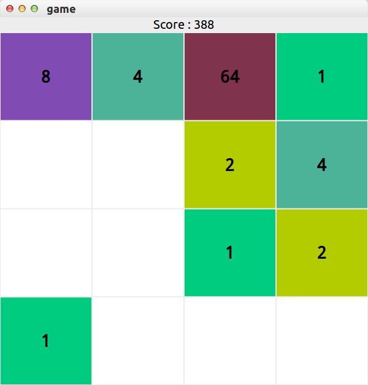

# Gtk2048
It's a 2048 game write in gtkmm.



## build

We used cmake to build the project, please check the gtkmm-3.0 installed first.

In Ubuntu, use apt-get to install it:
```
   sudo apt-get install cmake libgtkmm-3.0-dev
```

Then, build the project.

```
mkdir build
cd build
cmake ..
make
```

## doxygen doc 

It's used Doxygen to build the document.

```
cd build
make doc
```
